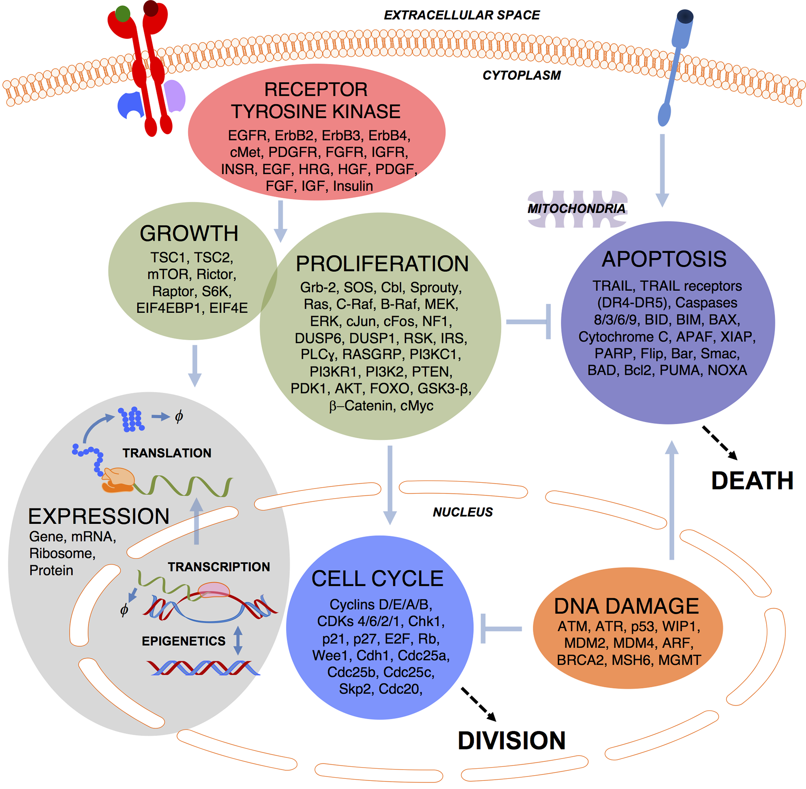
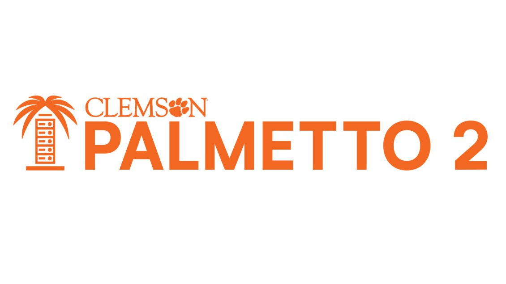

---
html_theme.sidebar_secondary.remove:
sd_hide_title: true
---

(homepage)=
# SPARCED: Large-Scale Human Cell Mechanistic Modeling

  <!-- Start Hero Left -->
  <h2 style="font-size: 60px; font-weight: bold; margin: 2rem auto 0;"> SPARCED </h2>
  <h3 style="font-weight: bold; margin-top: 0;"> Large-Scale Human Cell Mechanistic Modeling </h3>
  
 SPARCED is one of the largest mechanistic models of a human cell in the literature.
      Its modeling pipeline is open-source and serves for creating and simulating cellular pathway models.
  

<!-- Hero Left Buttons -->

  

      <a href="./quickstart.html" class="homepage-button primary-button"> Get Started </a>
      <a href="./about/index.html" class="homepage-button secondary-button"> Learn More </a>
  

  

      <a href="./community/devs/reference/summary.html" class="homepage-button-link"> For Developers: Access Technical Documentation → </a>
  

 <!-- End Hero Left Buttons -->

  <!-- End Hero Left -->

  

 <!-- End Hero Right -->

 <!-- End Hero -->

# Contribute

::::{tab-set}

:::{tab-item} Cellular Pathway Modeling
SPARCED is an ongoing project that is continuously expanded by the community.
Extensions of the original model and additional pathway models are very welcome.
See our [contribution guide](community/modelers.md) to learn more about the process.
If you have a question, do not hesitate to [contact](contact.md) us.
:::

:::{tab-item} For Developers
Contributions to the development of SPARCED and issue reports are very welcome on
[our GitHub repository](https://github.com/SPARCED/SPARCED).
Technical documentation is available in the [developers guide](community/devs/index.md).
If you have a question, do not hesitate to [contact](contact.md) us.
:::
::::

# Institutional Partners

The following institutions support the development and maintenance of SPARCED:

::::{grid} 2 2 4 4

:::{grid-item}

:::
:::{grid-item}

:::
:::{grid-item}

:::
:::{grid-item}

:::
::::

# Citation

Please cite SPARCED using 
 

:::{toctree}
:maxdepth: 1
:hidden:

Getting Started <quickstart>
About <about/index>
User Guide <user_guide/index>
Model Format <modeling/index>
Examples <examples/index>
Contribute <community/index>
Contact <contact>
:::
